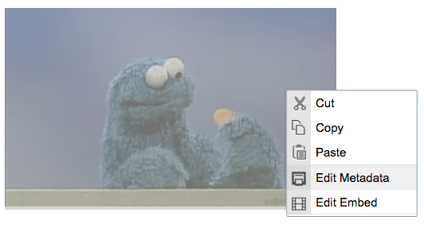

# ckeditor-metadata

> Manage metadata of selected CKEditor elements

This is a specialized plugin that allows you to add some metadata to selected CKEditor elements through a context menu. It works by managing
separate `data-` attributes to the HTML element.

**Because this is a specialized plugin:** You can only manage metadata
attributes on the following tags: `` and `<div class="iframe-insulator">`. If you want more universal support, read the 
[customization instructions](https://github.com/radiovisual/ckeditor-metadata#customization) below.

This plugin is meant to be used with [ckeditor-iframeinsulator](https://github.com/radiovisual/ckeditor-iframeinsulator), which 
allows you to attach CKEditor context menus to embedded iframes (even ones that override the right click behavior).

The metadata managed by this plugin:

- Caption
- Credit
- Tweet Text
- Facebook Text

## Installation

1. Copy the metadata plugin files to your CKEditor's plugin folder: `ckeditor/plugins/`
2. Add the plugin to the CKEDITOR configuration:
```js
CKEDITOR.config.extraPlugins = 'metadata';
```
3. Ensure that this plugin can create content:
```js
CKEDITOR.config.allowedContent = true;
```
4. For best results, disable the default `iframe` plugin:
```js
CKEDITOR.config.removePlugins = 'iframe';
```

## Usage

Once installed, you can right-click on the relevant tags within your editor and choose the 'Edit Metadata' context menu item.



## Customization

I wont be accepting pull requests on this project because it's just too specialized, and I don't work with CKEditor
enough (nor am I a fan) to justify spending much time on this plugin. With that said, it would be really easy
to customize this plugin to be more universal, allowing you to add metadata on any element, of any type. So you can treat 
this project like a boilerplate to get you started on your own metadata plugin. To do so, simply fork this project, then
change [this section](https://github.com/radiovisual/ckeditor-metadata/blob/master/plugin.js#L21) of `plugin.js`:

```js
// currently, the context menu only appears on these tags:
// `` and `<div class="iframe-insulator">`
editor.contextMenu.addListener(function (element) {
    var div = element.getAscendant('div', true);
	var isIFrameWrapper = div ? div.hasClass('iframe-insulator') : null;
	var img = element.getAscendant('img', true);

	if ((div && isIFrameWrapper) || img) {
	    return {metadataItem: CKEDITOR.TRISTATE_OFF};
	}
	return false;
});
```

To remove the restrictions, you can write your own logic. Something like:

```js
editor.contextMenu.addListener(function (element) {
    // ... your custom logic here
    // ... to see if we should launch the contextMenu
    if (iShouldShowContextMenu === true) {
        return {metadataItem: CKEDITOR.TRISTATE_OFF};
    }
    // else, don't show the context menu
    return false;
});
```

From there, all you need to do is add your custom metadata types to [dialogs/metadata.js](https://github.com/radiovisual/ckeditor-metadata/blob/master/dialogs/metadata.js#L12).

## License

MIT @ [Michael Wuergler](http://numetriclabs.com)
